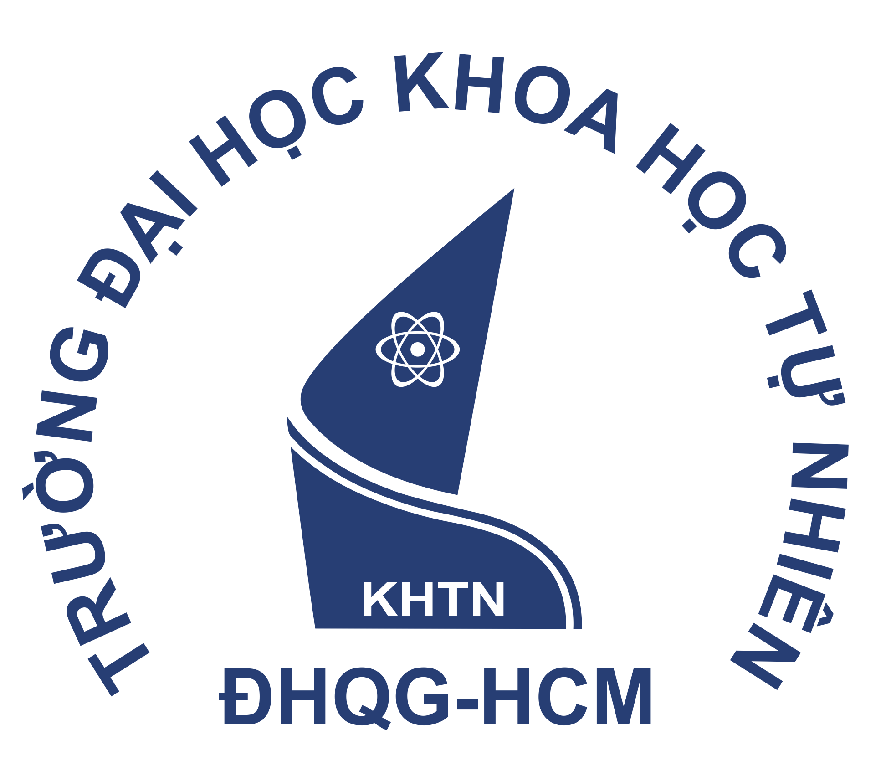
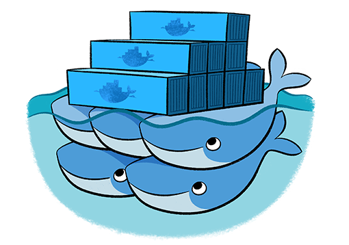
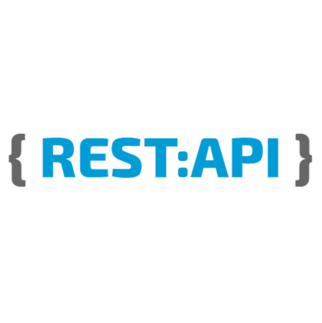
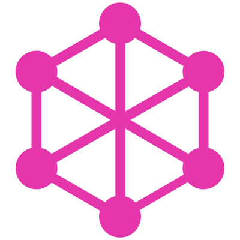

<h1 align="center">
    Hi , I'm <b>NGUYEN THANH QUAN</b> 
    (Quan Blue)
</h1>

 
    
    

    
    
    
    
    
    

 

### STUDY

<table style="border-collapse: collapse;">
    <tr>
        <td align="center">
            
        </td>
        <td>
            <h3 style="margin: 0;">VNUHCM - University of Science</h3> 
            2019 - 2023
            
Bachelor of <b>Computer Network and Information Security</b>

        </td>
    </tr>
</table>

### BIO

- 🔭 Kinda **self-motivated learner**.
- &nbsp;&nbsp; Specifically interested in **Automation**, **Cyber Security** and **Web Development**.
-  Looking to work on position 
-  Ping me about **Job**.
- &nbsp; I enjoy **listening music** 🎧, **calisthenic** 🏋️‍♂️ and **play badminton** 🏸
-  Reach me: &nbsp; 

### TECHNOLOGY

<table>
    <tr>
        <td></td>
        <td><b>Using</b></td>
        <td><b>Learning</b></td>
    </tr>
    <tr>
        <td>Framework</td>
        <td>
            
            &nbsp;
            
            &nbsp;
            
        </td>
        <td></td>
    </tr>
    <tr>
        <td>Languages</td>
        <td>
            
            &nbsp;
            
            &nbsp;
            
            &nbsp;
            
            &nbsp;
            
            &nbsp;
            
            &nbsp;
            
             &nbsp;
            
        </td>
        <td>
            
        </td>
    </tr>
    <tr>
        <td>CI/CD</td>
        <td>
            
        </td>
        <td>
                        
        </td>
    </tr>
     <tr>
        <td>Virtualization</td>
        <td>
            
            &nbsp;
            
            &nbsp;
            
        </td>
        <td></td>
    </tr>
    <tr>
        <td>Containerization</td>
        <td>
            
        </td>
        <td></td>
    </tr>
    <tr>
        <td>Container Orchestration</td>
        <td>
            
        </td>
        <td>
            
        </td>
    </tr>
    <tr>
        <td>Container Management</td>
        <td>
        </td>
        <td>
              
              
        </td>
    </tr>
     <tr>
        <td>Monitoring and Logging</td>
        <td>
          
            &nbsp;
            
        </td>
        <td></td>
    </tr>
     <tr>
        <td>Infrastructure as Code</td>
        <td>
          
        </td>
        <td>
            
        </td>
    </tr>
         <tr>
        <td>Cloud Platform</td>
        <td>
        </td>
        <td>
            
        </td>
    </tr>
    <tr>
        <td>SCM</td>
        <td>
            
            &nbsp;
        </td>
        <td></td>
    </tr>
    <tr>
        <td>IDE/ Text Editor</td>
        <td>
            
            &nbsp;
        </td>
        <td></td>
    </tr>
    <tr>
        <td>Database</td>
        <td>
            
            &nbsp;
            
        </td>
        <td></td>
    </tr>
     <tr>
        <td>API</td>
        <td>
             
            &nbsp;
            
        </td>
        <td></td>
    </tr>
    <tr>
        <td>Design Tools</td>
        <td>
            
            &nbsp;
            
        </td>
        <td></td>
    </tr>
</table>

### PROJECTS AND DEV STUFF

	
    
<b>⚡ Github Stats</b>

     
    

        
    

	
  
<b>☄️ Github Streaks</b>

  
   
  

  
<b>🧑‍🚀 Top Open Source Projects</b>

   
<!-- These templates will have you quickly bootstrapping your next project. -->

> **Note:** These projects are not quite actively maintained, but I will try to keep them up to date with new features as much as possible 🌱.
>  

  <table>
    <thead align="center">
      <tr border: none;>
        <td><b>💻 Projects</b></td>
        <td><b>🌟 Stars</b></td>
        <td><b>🍴 Forks</b></td>
        <td><b>🐛 Issues</b></td>
        <td><b>🔔 Pull Requests</b></td>
        <td><b>👨‍💻 Language</b></td>
      </tr>
    </thead>
    <tbody>
      <tr>
	      <td><a href="https://github.com/QuanBlue/Portfolio"><b>Portfolio website</b></a></td>
        <td></td>
        <td></td>
        <td></td>
        <td></td>
        <td></td>
      </tr>
      <tr>
	      <td><a href="https://github.com/QuanBlue/chat-grpc"><b>Chat gRPC application</b></a></td>
        <td></td>
        <td></td>
        <td></td>
        <td></td>
        <td></td>
      </tr>
      <tr>
	      <td><a href="https://github.com/QuanBlue/tech-automator"><b>Technology automator</b></a></td>
        <td></td>
        <td></td>
        <td></td>
        <td></td>
        <td></td>
      </tr>
      <tr>
	    <td><a href="https://github.com/QuanBlue/tech-cheatsheets"><b>Technology cheat sheets</b></a></td>
        <td></td>
        <td></td>
        <td></td>
        <td></td>
        <td></td>
      </tr>
      <tr>
	    <td><a href="https://github.com/QuanBlue/ansible-web-app-deployment"><b>Ansible auto deploy Web application</b></a></td>
        <td></td>
        <td></td>
        <td></td>
        <td></td>
        <td></td>
      </tr>
      <tr>
	    <td><a href="https://github.com/QuanBlue/linux-auto-setup"><b>Linux auto setup</b></a></td>
        <td></td>
        <td></td>
        <td></td>
        <td></td>
        <td></td>
      </tr>
       <tr>
	      <td><a href="https://github.com/HCMUS-Project/Gmail Remote Control"><b>Gmail remote control application</b></a></td>
        <td></td>
        <td></td>
        <td></td>
        <td></td>
        <td></td>
      </tr>
      <tr>
	      <td><a href="https://github.com/HCMUS-Project/Jurassic-Adventure-game"><b>Jurassic Adventure game</b></a></td>
        <td></td>
        <td></td>
        <td></td>
        <td></td>
        <td></td>
      </tr>
      <tr>
	      <td><a href="https://github.com/HCMUS-Project/Safety-application"><b>Safety application</b></a></td>
        <td></td>
        <td></td>
        <td></td>
        <td></td>
        <td></td>
      </tr>
      <tr>
	      <td><a href="https://github.com/HCMUS-Project/Storage-File-System.git"><b>Storage File System application</b></a></td>
        <td></td>
        <td></td>
        <td></td>
        <td></td>
        <td></td>
      </tr>
    </tbody>
  </table>
   

 

---

    <h2>Thanks for visiting </h2>

