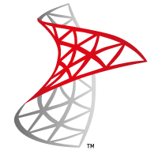
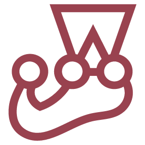

<h1 align="center">Hi , I'm <b>NGUYEN THANH QUAN</b></h1>

 
    
    

<h2> Connect with me
</h2> 
    
    
    
    
    
    

#### NOW

-   Currently last-year undergraduate student at **VNUHCM-University of Science**, majoring in **Computer Networks & Cybersecurity**.
-  🎯 My goal is become a **DevOps engineer 💻**

### BIO

-  🔭 Kinda **self-motivated learner**.
-  &nbsp;&nbsp; Specifically interested in **Automation**, **Cyber Security** and **Web Development**.
-   Looking to work on position 
-   Ping me about **Job**.
-  &nbsp; I enjoy **listening music** 🎧, **calisthenic** 🏋️‍♂️ and **play badminton** 🏸
-   Reach me: &nbsp; 

### TECHNOLOGY

<table>
    <tr>
        <td>Framework</td>
        <td>
            
            &nbsp;
            
            &nbsp;
            
        </td>
    </tr>
    <tr>
        <td>Languages</td>
        <td>
            
            &nbsp;
            
            &nbsp;
            
            &nbsp;
            
            &nbsp;
            
            &nbsp;
            
            &nbsp;
            
        </td>
    </tr>
    <tr>
        <td>CI/CD</td>
        <td>
            
            &nbsp;
            
            &nbsp;
        </td>
    </tr>
    <tr>
        <td>SCM</td>
        <td>
            
            &nbsp;
            
            &nbsp;
        </td>
    </tr>
    <tr>
        <td>IDE/ Text Editor</td>
        <td>
            
            &nbsp;
            
            &nbsp;
        </td>
    </tr>
    <tr>
        <td>Database</td>
        <td>
            
            &nbsp;
            
        </td>
    </tr>
     <tr>
        <td>API</td>
        <td>
             
            &nbsp;
            
        </td>
    </tr>
    <tr>
        <td>Design Tools</td>
        <td>
            
            &nbsp;
            
        </td>
    </tr>
</table>

#### And

<table>
    <tr>
        <th>I'm currently studying: </th>
    </tr>
    <tr>
        <td>
            
            &nbsp;
            
            &nbsp;
            
        </td>
    </tr>
</table>

### PROJECTS AND DEV STUFF

	
    
<b>⚡ Github Stats</b>

     
    

        
    

	
  
<b>☄️ Github Streaks</b>

  
   
  

  
<b>🧑‍🚀 Top Open Source Projects</b>

   
<!-- These templates will have you quickly bootstrapping your next project. -->

> **Note:** These projects are not quite actively maintained, but I will try to keep them up to date with new features as much as possible 🌱.
>  

  <table>
    <thead align="center">
      <tr border: none;>
        <td><b>💻 Projects</b></td>
        <td><b>🌟 Stars</b></td>
        <td><b>🍴 Forks</b></td>
        <td><b>🐛 Issues</b></td>
        <td><b>🔔 Pull Requests</b></td>
        <td><b>👨‍💻 Language</b></td>
      </tr>
    </thead>
    <tbody>
      <tr>
	      <td><a href="https://github.com/QuanBlue/Portfolio"><b>🚀 Portfolio</b></a></td>
        <td></td>
        <td></td>
        <td></td>
        <td></td>
        <td></td>
      </tr>
       <tr>
	      <td><a href="https://github.com/HCMUS-Project/Gmail-Remote-Control"><b>🎮 Gmail-Remote-Control</b></a></td>
        <td></td>
        <td></td>
        <td></td>
        <td></td>
        <td></td>
      </tr>
    </tbody>
  </table>
   

 

---

    <h2>Thanks for visiting </h2>

